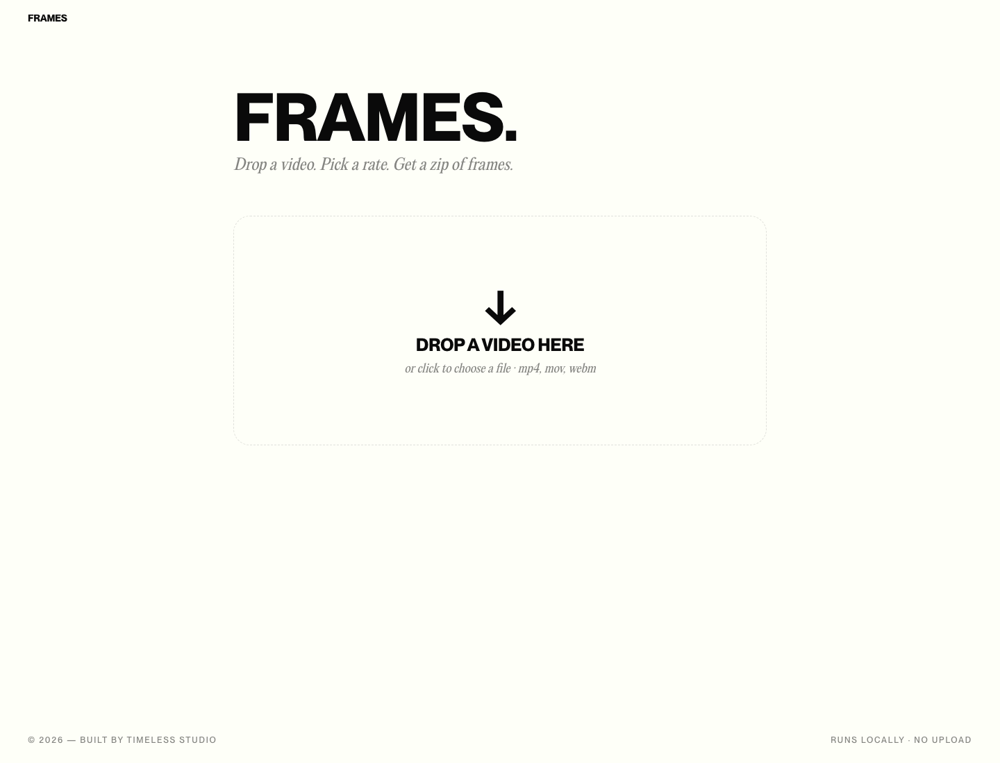

# Frames

Drop an MP4, get a ZIP of every frame. Runs entirely in the browser — your video never leaves your device.



## What it does

- Drag-and-drop (or click) any `.mp4`, `.mov`, `.webm`, `.mkv`
- Pick an extraction rate: **every frame**, **1 fps**, or **every N seconds**
- Trim a time range with a dual-thumb scrubber that previews the video live
- See an estimate (`≈ 180 frames · ≈ 35 MB`) before committing
- Watch a progress bar and live thumbnail grid as frames render
- Download a ZIP named whatever you want; frames are named with their timestamps (`frame_00m12s345.png`)

No server, no upload, no auth. Powered by [`ffmpeg.wasm`](https://github.com/ffmpegwasm/ffmpeg.wasm) — the first extraction loads ~30 MB of WebAssembly core, then it's instant.

## Stack

- Next.js 16.2.6 (App Router, Turbopack)
- React 19
- Tailwind CSS v4
- `@ffmpeg/ffmpeg` v0.12 + `@ffmpeg/util`
- `jszip`
- `motion` (formerly framer-motion)

## Run locally

```bash
npm install
npm run dev
```

Then open <http://localhost:3000>.

The app needs cross-origin isolation to use `SharedArrayBuffer` (required by ffmpeg.wasm). The `next.config.ts` sends `Cross-Origin-Opener-Policy: same-origin` and `Cross-Origin-Embedder-Policy: require-corp` headers automatically — works on Vercel and most other hosts without further config.

## Project layout

```
src/
├── app/                       # Next App Router entrypoint
├── components/
│   ├── chrome/                # TopNav, Footer
│   ├── primitives/            # ButtonPill
│   ├── extractor/             # Dropzone, SettingsPanel, ProgressView,
│   │                          # ThumbnailGrid, RangeSlider, VideoPreview
│   └── ui/                    # text-roll (hero hover effect)
└── lib/
    ├── ffmpeg.ts              # lazy ffmpeg loader + extractFrames(...)
    ├── zip.ts                 # buildZip + downloadBlob
    ├── video.ts               # probe duration via <video>, estimate count
    ├── tokens.ts              # design tokens (cream/ink, easing, durations)
    └── utils.ts               # cn()
```

## Design

Visual language is shared with the studio site: cream (`#FEFFF8`) on ink (`#0A0A0A`), set in **PP Neue Montreal** (display) and **PP Editorial New** (serif). The fonts ship as `.otf` under `public/fonts/` and are licensed for personal use only — swap them before any commercial deployment.

---

Built by [Timeless Studio](https://timeless.studio).
